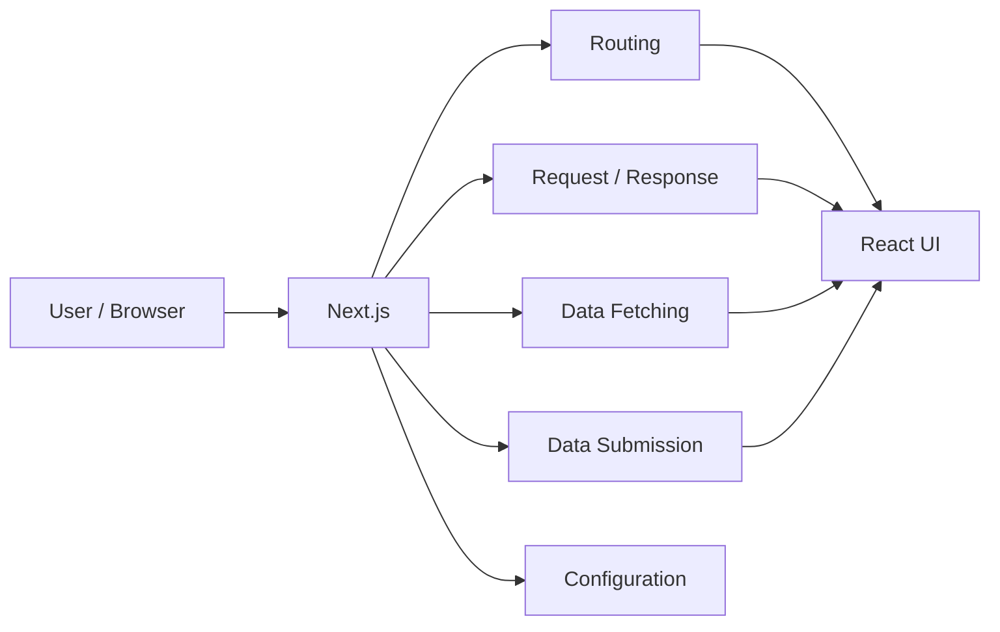

## 📖 Definition

**Next.js is a React framework for building full-stack web applications.** It simplifies React development by providing built-in application capabilities such as **routing, configuration, request/response handling, data fetching, and submissions**.

## ⚙️ How It Works

- **Routing** — manages application routes instead of requiring separate routing setup.
    
- **Configuration** — provides framework-level configuration for the application.
    
- **Requests & responses** — provides mechanisms to handle HTTP request/response flows.
    
- **Data fetching** — provides structured ways to fetch application data.
    
- **Submissions** — supports handling data submitted by users.
    
- Overall, Next.js **simplifies React by providing the surrounding application infrastructure**.
    

**Real-world example — E-commerce:**  
In an e-commerce application, Next.js can manage the product route, fetch product data, render the React UI, and handle user submissions within the same application framework.

## 🖼️ Visual Reference

Image search: "Next.js React full stack architecture routing data fetching diagram"

## ⚠️ Interview Traps & Gotchas

| Question/Angle                           | Key Answer                                                                                | Gotcha/Follow-up                                                      |
| ---------------------------------------- | ----------------------------------------------------------------------------------------- | --------------------------------------------------------------------- |
| Why do we need Next.js?                  | It simplifies building full-stack applications with React.                                | Don't describe it as a replacement for React.                         |
| What does Next.js handle?                | Routes, configuration, requests/responses, data fetching, and submissions.                | These are framework-level capabilities around React.                  |
| What does React primarily provide?       | The UI layer for building interfaces.                                                     | Next.js adds application infrastructure around React.                 |
| Why is Next.js useful for rich products? | It brings multiple application capabilities into one framework.                           | Avoid saying Next.js automatically handles every backend requirement. |
| Is Next.js a JavaScript framework?       | Yes; specifically, a framework built around React.                                        | React itself is a library.                                            |
| What is the simplest interview answer?   | **React handles the UI; Next.js simplifies building the complete application around it.** | Be ready to explain the specific features Next.js provides.           |

## ⚡ Quick Revision

- **Next.js = React framework for full-stack web applications.**
    
- Handles **routing, configuration, requests/responses, data fetching, and submissions**.
    
- **React → UI; Next.js → application framework around React.**
    
- Main benefit: **simplifies building production-ready React applications.**
    

|Topic|Quick Recall|
|---|---|
|Next.js|React framework for full-stack web applications|
|Core features|Routing, configuration, requests/responses, data fetching, submissions|
|Main purpose|Simplifies React application development|
|Interview one-liner|**React handles UI; Next.js provides the application framework around it.**|