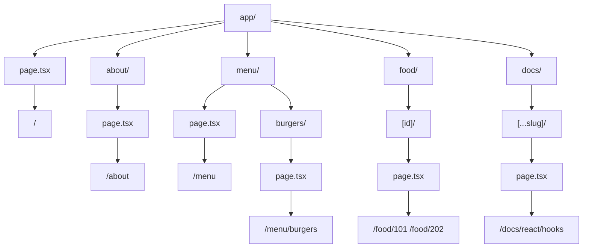

## 📖 Definition

**File-based routing** in Next.js App Router means the application's URL structure is derived from the folder and file structure inside `app/`. A folder creates a **route segment**, while a `page.tsx` file makes that route publicly accessible. Next.js automatically maps this filesystem structure to URL paths, so no separate route configuration is required.

## ⚙️ How It Works

### 1. Root route

```text
app/
└── page.tsx
```

Maps to:

```text
/
```

Think:

```text
app/page.tsx
     ↓
    /
```

`page.tsx` is special — it tells Next.js:

> "This directory represents a page that can be visited."

### 2. Creating another route

If you create:

```text
app/
├── page.tsx
└── about/
    └── page.tsx
```

Next.js maps:

```text
app/page.tsx
      ↓
     /

app/about/page.tsx
      ↓
    /about
```

You don't need to write:

```js
router.add("/about", ...)
```

The filesystem itself defines the route.

### 3. Nested routes

Folders can be nested to create deeper URL paths:

```text
app/
└── menu/
    ├── page.tsx
    └── burgers/
        └── page.tsx
```

Creates:

```text
/menu
/menu/burgers
```

The mapping is:

```text
app/
 └── menu/
      └── burgers/
           └── page.tsx
                    ↓
             /menu/burgers
```

### 4. Dynamic routes

When the URL contains a value that changes, use `[param]`.

```text
app/
└── food/
    └── [id]/
        └── page.tsx
```

This can match:

```text
/food/101
/food/202
/food/999
```

Inside the page, the `id` identifies which food item was requested.

```text
/food/[id]
      ↓
    dynamic
      ↓
/food/101
/food/202
/food/999
```

### 5. Catch-all routes

You can capture multiple URL segments using `[...slug]`.

```text
app/
└── docs/
    └── [...slug]/
        └── page.tsx
```

Can match paths such as:

```text
/docs/react
/docs/react/hooks
/docs/react/hooks/use-state
```

This is useful for hierarchical content such as documentation.

### 6. Route groups

Parentheses `( )` allow you to organize routes **without adding the folder name to the URL**.

```text
app/
├── (shop)/
│   ├── products/
│   │   └── page.tsx
│   └── cart/
│       └── page.tsx
```

URLs:

```text
/products
/cart
```

**Not:**

```text
/shop/products
/shop/cart
```

The `(shop)` folder is an organizational route group, not a URL segment.

### 7. Layouts and routes

`layout.tsx` is different from `page.tsx`.

```text
app/
├── layout.tsx
├── page.tsx
└── about/
    └── page.tsx
```

- `page.tsx` → actual UI for a route.
    
- `layout.tsx` → shared UI surrounding pages in that route segment.
    
- Layouts can be nested.
    

For example:

```text
app/
├── layout.tsx
└── dashboard/
    ├── layout.tsx
    └── page.tsx
```

The dashboard page can be rendered inside both layouts.

### 8. Special files in App Router

The App Router uses special filenames to provide framework behavior:

```text
app/
├── layout.tsx       → shared layout
├── page.tsx         → page/route
├── loading.tsx      → loading UI
├── error.tsx        → error UI
├── not-found.tsx    → not-found UI
└── route.ts         → HTTP endpoint
```

This is an important distinction:

> **Not every file inside `app/` becomes a route.**

`page.tsx` creates a page route; `layout.tsx`, `loading.tsx`, `error.tsx`, etc. have special framework roles.

### Complete routing example

```text
app/
│
├── page.tsx
│       → /
│
├── about/
│   └── page.tsx
│       → /about
│
├── menu/
│   ├── page.tsx
│   │   → /menu
│   │
│   └── burgers/
│       └── page.tsx
│           → /menu/burgers
│
├── food/
│   └── [id]/
│       └── page.tsx
│           → /food/:id
│
└── docs/
    └── [...slug]/
        └── page.tsx
            → /docs/*
```



**Real-world example — Food ordering application:**

```text
app/
├── page.tsx
├── about/
│   └── page.tsx
├── menu/
│   └── page.tsx
├── food/
│   └── [id]/
│       └── page.tsx
└── cart/
    └── page.tsx
```

This automatically gives you:

```text
/                 → Home
/about            → About
/menu             → Menu
/food/123         → Food item 123
/cart             → Cart
```

So adding a new page is largely a matter of **creating the appropriate folder and `page.tsx` file**.

## 🖼️ Visual Reference

Image search: "Next.js App Router file based routing folder structure dynamic nested routes diagram"

## ⚠️ Interview Traps & Gotchas

|Question/Angle|Key Answer|Gotcha/Follow-up|
|---|---|---|
|How does App Router create routes?|Folders represent route segments and `page.tsx` exposes the page.|No separate route configuration is required.|
|What does `app/about/page.tsx` create?|`/about`|`app` itself is not part of the URL.|
|What does `app/page.tsx` create?|`/`|It is the root route.|
|Does every file in `app/` become a route?|**No.**|`page.tsx` is the file that exposes a UI route; other special files have different purposes.|
|How are nested routes created?|Nest folders inside folders.|`app/menu/burgers/page.tsx` → `/menu/burgers`.|
|How are dynamic routes created?|Use `[param]`, e.g. `[id]`.|`/food/[id]` can match `/food/123`, `/food/456`, etc.|
|What is `[...slug]`?|Catch-all dynamic route.|It captures multiple path segments.|
|What is `(shop)`?|Route group for organization.|The group name does **not** appear in the URL.|

## ⚡ Quick Revision

- **Folder = URL segment; `page.tsx` = publicly accessible page.**
    
- `app/about/page.tsx` → **`/about`**
    
- `app/menu/burgers/page.tsx` → **`/menu/burgers`**
    
- `[id]` → **dynamic segment**; `[...slug]` → **catch-all**.
    
- `(group)` → organization without adding a URL segment.
    
- **`page.tsx` creates the route; other special files provide framework behavior.**
    

|Topic|Quick Recall|
|---|---|
|File-based routing|Filesystem determines URL structure|
|`page.tsx`|Exposes a UI route|
|Nested route|Nested folders → nested URL|
|Dynamic route|`[id]` → variable URL segment|
|Catch-all|`[...slug]` → multiple URL segments|
|Route group|`(group)` → organization without URL segment|
|Special files|`layout`, `loading`, `error`, `not-found`, `route` have framework-specific roles|