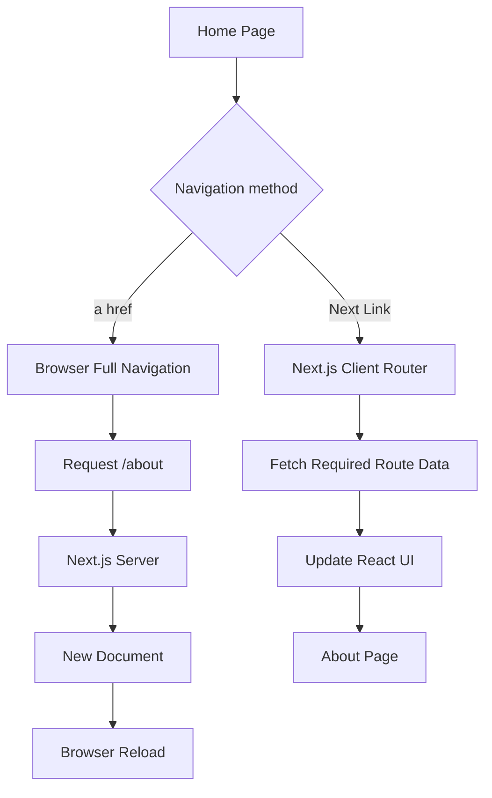

## 📖 Definition

In Next.js, `<a href>` performs a **normal browser navigation**, which can trigger a full document request. `<Link>` from `next/link` enables **client-side navigation**, allowing Next.js to change routes without unnecessarily reloading the entire page. This gives the application SPA-like navigation while still using Next.js server rendering capabilities.

## ⚙️ How It Works

### 1. The basic `<a href>` approach

From:

```tsx
// app/page.tsx

<a href="/about">About</a>
```

When the user clicks:

```text
Home
  ↓
<a href="/about">
  ↓
Browser navigation
  ↓
Request /about
  ↓
Server
  ↓
New HTML document
  ↓
Browser reloads page
```

The important point is:

> A normal `<a>` performs a **full browser navigation**.

It is perfectly valid, but for internal Next.js navigation it can cause unnecessary document-level work.

---

### 2. The Next.js `<Link>` approach

Next.js provides:

```tsx
import Link from "next/link";

<Link href="/about">About</Link>
```

Now the navigation can happen on the client:

```text
Home
  ↓
<Link href="/about">
  ↓
Next.js intercepts navigation
  ↓
Request required route data
  ↓
Update UI
  ↓
/about
```

The browser doesn't need to perform a traditional full-page navigation.

---

### 3. Why this feels like an SPA

A traditional SPA typically:

```text
User clicks link
      ↓
JavaScript handles navigation
      ↓
Only required UI changes
      ↓
No full document reload
```

Next.js `<Link>` provides a similar navigation experience:

```text
User clicks <Link>
        ↓
Next.js client router
        ↓
Fetch required route/RSC data
        ↓
Update React tree
        ↓
New page displayed
```

So you get **SPA-like navigation while retaining Next.js's server-side capabilities**.

---

### 4. What happens when you manually enter `/about`?

If you type:

```text
http://localhost:3000/about
```

into the browser:

```text
Browser
   ↓
GET /about
   ↓
Next.js Server
   ↓
app/about/page.tsx
   ↓
Server renders required output
   ↓
Browser
```

This is a **direct document request**.

That's different from clicking a `<Link>` from an already-running Next.js application.

---

### 5. Why `<Link>` is better for internal navigation

`<Link>` can provide:

- **Client-side navigation** → avoids unnecessary full-page reloads.
    
- **Prefetching** → Next.js can prefetch routes when appropriate, making navigation feel faster.
    
- **Preservation of application state** where applicable.
    
- **Next.js routing integration** → works with the App Router rather than relying only on browser navigation.
    



**Real-world example — Food ordering app:**  
On a food app, clicking **Menu → Burgers → Pizza** with `<Link>` lets Next.js navigate between these internal pages without performing a traditional full-page browser reload, making the experience feel much closer to a SPA.

## 🖼️ Visual Reference

Image search: "Next.js Link client side navigation vs anchor full page reload diagram"

## ⚠️ Interview Traps & Gotchas

|Question/Angle|Key Answer|Gotcha/Follow-up|
|---|---|---|
|`<a href>` vs `<Link>`?|`<a>` performs normal browser navigation; `<Link>` enables Next.js client-side navigation.|Don't say `<a>` is invalid in Next.js.|
|Does `<Link>` make Next.js a SPA?|It provides **SPA-like client-side navigation**.|Next.js is not simply a client-only SPA; it retains server-side capabilities.|
|What happens when `/about` is manually entered?|Browser makes a request to the Next.js server.|This is different from client-side navigation via `<Link>`.|
|Why is `<Link>` faster?|It avoids unnecessary full document reloads and can prefetch routes.|Don't claim every navigation is completely network-free.|
|Does `<Link>` make a server request?|It may fetch required route data from the server.|Client-side navigation doesn't mean "no server communication."|
|What is prefetching?|Next.js can load route resources before the user clicks the link.|Prefetching behavior depends on the environment and route.|
|When should you use `<a>`?|For external URLs or when normal browser navigation is intentionally desired.|Use `<Link>` for normal internal Next.js routes.|

## ⚡ Quick Revision

- `<a href="/about">` → **normal browser navigation / full document request**.
    
- `<Link href="/about">` → **Next.js client-side navigation**.
    
- `<Link>` gives **SPA-like navigation without turning Next.js into a client-only SPA**.
    
- Next.js can **prefetch** linked routes to make navigation feel faster.
    
- Manual URL entry/refresh → **browser requests the page from the server**.
    

|Topic|Quick Recall|
|---|---|
|`<a>`|Normal browser navigation|
|`<Link>`|Next.js client-side navigation|
|SPA-like behavior|Update route/UI without full document reload|
|Manual URL|Browser requests route from server|
|Prefetching|Route resources can be fetched before navigation|
|Main benefit|Faster, smoother internal navigation|
