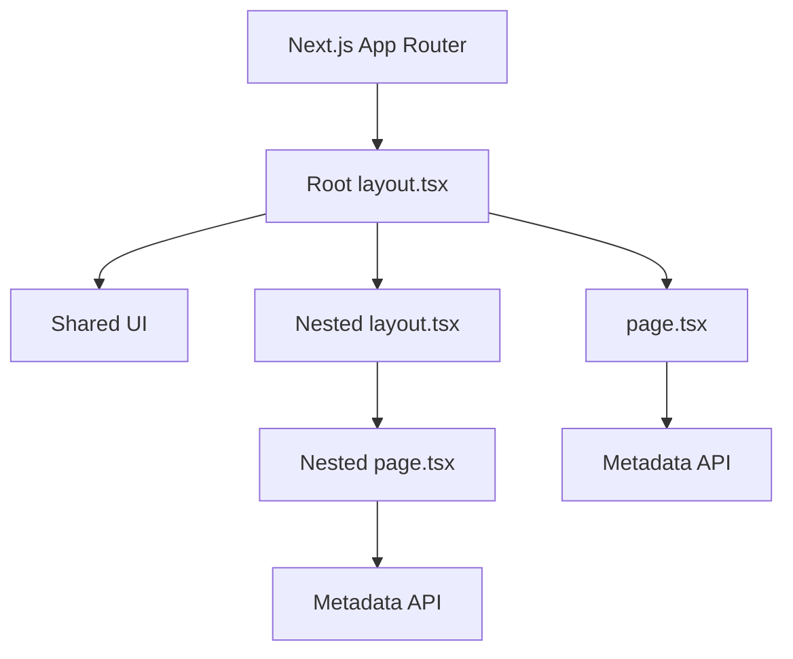

## 📖 Definition

In the Next.js App Router, a **`page.tsx` defines the UI for a specific route**, while **`layout.tsx` defines shared UI that wraps pages within a route segment**. Next.js also provides a Metadata API so page titles and SEO metadata can be defined through `metadata` instead of manually adding `<title>` in every page.

## ⚙️ How It Works

### `page.tsx` → The actual page

A `page.tsx` file represents the UI for a specific URL.

```text
app/
├── page.tsx
└── about/
    └── page.tsx
```

This creates:

```text
app/page.tsx
        ↓
       /

app/about/page.tsx
        ↓
      /about
```

Think:

> **`page.tsx` = content/page for a route**

---

### `layout.tsx` → The wrapper

A `layout.tsx` wraps the pages underneath its route segment.

```text
app/
├── layout.tsx
├── page.tsx
└── about/
    └── page.tsx
```

Conceptually:

```text
Root Layout
    │
    ├── Home Page
    │
    └── About Page
```

The layout is useful for UI that should be shared, such as:

- Navbar
    
- Footer
    
- Sidebar
    
- Common application structure
    

The layout receives `children`, which represents the page or nested layout being rendered inside it.

```tsx
export default function RootLayout({
  children,
}: {
  children: React.ReactNode;
}) {
  return (
    <html>
      <body>
        <Navbar />
        {children}
        <Footer />
      </body>
    </html>
  );
}
```

So:

```text
<RootLayout>
    <Navbar />

    {children}
       ↓
    page.tsx

    <Footer />
</RootLayout>
```

---

### Nested layouts

Layouts can also be nested.

```text
app/
├── layout.tsx
└── dashboard/
    ├── layout.tsx
    └── page.tsx
```

The rendering structure becomes:

```text
Root Layout
    ↓
Dashboard Layout
    ↓
Dashboard Page
```

This is useful when a particular section needs its own shared UI.

For example:

```text
Root Layout
    ├── Navbar
    │
    └── Dashboard Layout
          ├── Sidebar
          │
          └── Dashboard Page
```

---

### Metadata

Instead of manually putting:

```html
<title>About Us</title>
```

inside the page, Next.js provides the **Metadata API**.

Example:

```tsx
import type { Metadata } from "next";

export const metadata: Metadata = {
  title: "About Us",
  description: "Learn more about our company",
};

export default function AboutPage() {
  return <h1>About Us</h1>;
}
```

Next.js uses this metadata to generate the appropriate `<head>` elements.

You can also define common metadata in `layout.tsx` and customize it in individual pages.



**Real-world example — Food ordering app:**  
A food application can put the **Navbar and Footer** in `app/layout.tsx`, while `app/menu/page.tsx` contains the menu UI. The menu page can define metadata such as `"Menu | Food App"` without manually writing a `<title>` element.

## 🖼️ Visual Reference

Image search: "Next.js App Router layout.tsx page.tsx nested layouts metadata architecture"

## ⚠️ Interview Traps & Gotchas

|Question/Angle|Key Answer|Gotcha/Follow-up|
|---|---|---|
|What is `page.tsx`?|UI for a specific route.|A route generally needs a `page.tsx` to be publicly accessible.|
|What is `layout.tsx`?|A shared wrapper around pages/nested layouts.|It isn't itself the page content.|
|What does `children` represent?|The page or nested layout rendered inside the current layout.|The layout controls the surrounding UI.|
|Why use layouts?|To share UI such as Navbar, Footer, and Sidebar across routes.|Avoid duplicating the same UI in every page.|
|Can layouts be nested?|Yes.|A child route can have its own layout inside the parent layout.|
|How do you set a page title?|Use Next.js Metadata API.|Don't confuse metadata with the visible page content.|
|Where can metadata be defined?|In pages/layouts using `metadata` or dynamic metadata APIs.|Metadata is used to generate `<head>` information.|

## ⚡ Quick Revision

- **`page.tsx` = route's actual UI.**
    
- **`layout.tsx` = wrapper/shared UI around routes.**
    
- `children` = the page/nested layout rendered inside the layout.
    
- Layouts can be **nested**.
    
- Next.js **Metadata API** handles titles and other metadata instead of manually adding `<title>` to every page.
    

|Topic|Quick Recall|
|---|---|
|`page.tsx`|UI for a specific route|
|`layout.tsx`|Shared wrapper around routes|
|`children`|Page/nested layout inside the wrapper|
|Nested layouts|Layouts can exist at multiple route levels|
|Metadata|Next.js API for titles, descriptions, and other metadata|
|Key distinction|**Page = content; Layout = shared wrapper**|