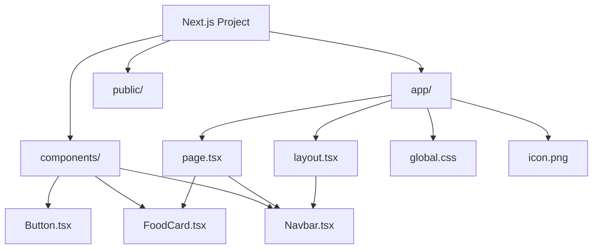

## 📖 Definition

Next.js App Router uses certain **reserved filenames** to provide framework-specific behavior, while ordinary component files can be created freely inside the project. Files such as `layout.tsx`, `page.tsx`, `global.css`, and `icon.png` have special purposes, whereas custom components must be **imported and used explicitly** in pages or layouts.

## ⚙️ How It Works

### 1. `global.css`

- `global.css` contains styles that apply globally across the application.
    
- It is typically imported from the root `layout.tsx`.
    
- Because the root layout wraps the application, global styles become available throughout the app.
    

```tsx
// app/layout.tsx

import "./global.css";

export default function RootLayout({
  children,
}: {
  children: React.ReactNode;
}) {
  return (
    <html>
      <body>{children}</body>
    </html>
  );
}
```

Flow:

```text
global.css
    ↓
layout.tsx
    ↓
Root Layout
    ↓
Application pages
```

### 2. `icon.png`

If you place an icon in the appropriate App Router location:

```text
app/
├── icon.png
├── layout.tsx
└── page.tsx
```

Next.js recognizes `icon.png` as an **application icon/favicon** through its file-based metadata conventions.

The important idea:

> Some filenames are recognized by Next.js and automatically receive framework-specific behavior.

### 3. Custom components

You can create normal React components:

```text
components/
├── Navbar.tsx
├── Button.tsx
└── FoodCard.tsx
```

Next.js does **not** treat these files as routes.

For example:

```text
components/FoodCard.tsx
```

does **not** create:

```text
/food-card
```

Instead, import the component wherever you need it:

```tsx
import FoodCard from "@/components/FoodCard";

export default function MenuPage() {
  return <FoodCard />;
}
```

This separation is important:

```text
app/
    ↓
Routing + Next.js special files

components/
    ↓
Reusable React components
```

### 4. Recommended organization

A simple project can look like:

```text
my-food-app/
│
├── app/
│   ├── layout.tsx
│   ├── page.tsx
│   ├── global.css
│   └── icon.png
│
├── components/
│   ├── Navbar.tsx
│   ├── FoodCard.tsx
│   └── Button.tsx
│
├── public/
│   └── images/
│
├── package.json
└── tsconfig.json
```



**Real-world example — Food ordering app:**  
`app/menu/page.tsx` can import a reusable `components/FoodCard.tsx` for every food item. `components/FoodCard.tsx` doesn't create a route; it is simply a reusable React component.

## 🖼️ Visual Reference

Image search: "Next.js App Router project structure reserved files components folder diagram"

## ⚠️ Interview Traps & Gotchas

|Question/Angle|Key Answer|Gotcha/Follow-up|
|---|---|---|
|What is `global.css`?|Global stylesheet for the application.|It is commonly imported from the root `layout.tsx`.|
|What does `icon.png` do?|Next.js recognizes it as an application icon/favicon through its metadata file conventions.|It is not a page or route.|
|Does `components/Button.tsx` create a route?|**No.**|Only appropriate App Router route files such as `page.tsx` expose UI routes.|
|How are custom components used?|Import them into pages, layouts, or other components.|They remain normal React components.|
|Where should reusable components go?|Commonly in a `components/` directory.|This is an organizational convention, not a strict Next.js requirement.|
|What makes a file "special" in `app/`?|Next.js recognizes specific reserved filenames and gives them framework behavior.|Don't assume every file inside `app/` automatically becomes a route.|
|Is `components/` required?|No.|It's a common project-organization pattern.|

## ⚡ Quick Revision

- **`page.tsx` → route/page.**
    
- **`layout.tsx` → shared wrapper.**
    
- **`global.css` → global styling, commonly imported by root layout.**
    
- **`icon.png` → application favicon/icon through Next.js metadata conventions.**
    
- **Custom components → not routes; import and use them explicitly.**
    
- `components/` is a **convention, not a mandatory Next.js directory**.
    

|Topic|Quick Recall|
|---|---|
|`global.css`|Global styles, commonly imported in root layout|
|`icon.png`|Application icon/favicon|
|`page.tsx`|Reserved route file|
|Custom components|Normal React components, not routes|
|`components/`|Common place for reusable components|
|Key rule|**Next.js recognizes reserved files; custom components must be imported explicitly.**|