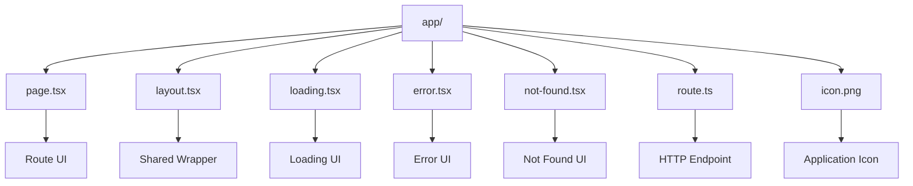

In the **Next.js App Router**, certain filenames have special meaning. They are called **file-system conventions**. Next.js recognizes these files automatically based on where they appear inside the `app/` directory.

## 📁 Main App Router Reserved Files

|File|Purpose|Example|
|---|---|---|
|`page.tsx`|Defines the UI for a route|`app/about/page.tsx` → `/about`|
|`layout.tsx`|Shared UI wrapper around a route and its children|`app/layout.tsx`|
|`template.tsx`|Similar to layout, but creates a new instance when navigating|`app/template.tsx`|
|`loading.tsx`|Loading UI displayed while route content loads|`app/menu/loading.tsx`|
|`error.tsx`|Error UI for a route segment|`app/menu/error.tsx`|
|`global-error.tsx`|Global error UI for handling errors at the root level|`app/global-error.tsx`|
|`not-found.tsx`|UI displayed when `notFound()` is triggered|`app/not-found.tsx`|
|`forbidden.tsx`|UI for a `forbidden()` response|`app/forbidden.tsx`|
|`unauthorized.tsx`|UI for an `unauthorized()` response|`app/unauthorized.tsx`|
|`route.ts`|Creates an HTTP endpoint / Route Handler|`app/api/users/route.ts`|
|`default.tsx`|Fallback UI for parallel routes|`app/@modal/default.tsx`|

### Route-specific special files

```text
app/
├── page.tsx
├── layout.tsx
├── template.tsx
├── loading.tsx
├── error.tsx
├── not-found.tsx
└── route.ts
```

Think of them as:

```text
page.tsx       → What should this route display?
layout.tsx     → What should wrap this route?
template.tsx   → What wrapper should be recreated on navigation?
loading.tsx    → What should users see while loading?
error.tsx      → What should users see when an error occurs?
not-found.tsx  → What should users see when content doesn't exist?
route.ts       → How should this URL handle HTTP requests?
```

## 🎨 Metadata & Image File Conventions

Next.js also recognizes special files for **metadata, icons, and social sharing images**.

|File|Purpose|
|---|---|
|`favicon.ico`|Browser favicon|
|`icon.png`|Application icon|
|`icon.svg`|Application icon|
|`apple-icon.png`|Apple touch icon|
|`apple-icon.jpg`|Apple touch icon|
|`opengraph-image.png`|Open Graph/social sharing image|
|`opengraph-image.jpg`|Open Graph/social sharing image|
|`twitter-image.png`|Twitter/X card image|
|`twitter-image.jpg`|Twitter/X card image|
|`robots.txt`|Controls crawler access|
|`sitemap.xml`|Provides search engines with site URL information|

For example:

```text
app/
├── icon.png
├── opengraph-image.png
├── robots.txt
├── sitemap.xml
├── layout.tsx
└── page.tsx
```

Next.js can recognize these according to its metadata/file conventions.

## 🔀 Dynamic & Routing Conventions

Some **folder/file naming patterns** are also special.

|Convention|Purpose|Example|
|---|---|---|
|`[id]`|Dynamic route segment|`app/food/[id]/page.tsx`|
|`[...slug]`|Catch-all route|`app/docs/[...slug]/page.tsx`|
|`[[...slug]]`|Optional catch-all route|`app/docs/[[...slug]]/page.tsx`|
|`(group)`|Route group; doesn't appear in URL|`app/(shop)/products/page.tsx`|
|`@slot`|Parallel route slot|`app/@modal/page.tsx`|
|`_folder`|Private folder; excluded from routing|`app/_components/`|

These are **routing conventions**, rather than reserved filenames.

## 🧠 The Most Important Ones for Interviews

Don't try to memorize every file equally. Know these extremely well:

```text
page.tsx
    ↓
Creates the route UI

layout.tsx
    ↓
Shared persistent wrapper

loading.tsx
    ↓
Loading UI

error.tsx
    ↓
Error boundary UI

not-found.tsx
    ↓
404-style UI

route.ts
    ↓
HTTP API / Route Handler

template.tsx
    ↓
Re-created wrapper on navigation
```

### Example: Food App

```text
app/
│
├── layout.tsx
│   → Navbar + Footer
│
├── page.tsx
│   → Home
│
├── menu/
│   ├── page.tsx
│   │   → Menu
│   ├── loading.tsx
│   │   → Menu loading screen
│   └── error.tsx
│       → Menu error screen
│
├── food/
│   └── [id]/
│       └── page.tsx
│           → Individual food
│
├── api/
│   └── orders/
│       └── route.ts
│           → Order API
│
├── icon.png
│   → Favicon/app icon
│
└── not-found.tsx
    → Not-found UI
```



## ⚠️ Important Interview Gotchas

|Question|Answer|
|---|---|
|Does every file inside `app/` create a route?|**No.** Only `page.tsx` exposes a UI route.|
|Is `layout.tsx` a page?|**No.** It wraps pages and nested layouts.|
|`page.tsx` vs `route.ts`?|`page.tsx` → UI; `route.ts` → HTTP endpoint.|
|`loading.tsx` vs `error.tsx`?|`loading.tsx` handles loading state; `error.tsx` handles runtime errors for the segment.|
|Is `components/` a reserved directory?|**No.** It's a common developer convention.|
|Is `icon.png` a route?|**No.** Next.js treats it as an application icon.|
|Are `[id]` and `(group)` files?|No. They are **special folder naming conventions**.|
|Does `global.css` create a route?|No. It's a stylesheet, commonly imported from the root layout.|

## ⚡ Quick Revision

- **`page.tsx` → Route UI**
    
- **`layout.tsx` → Shared wrapper**
    
- **`loading.tsx` → Loading UI**
    
- **`error.tsx` → Error UI**
    
- **`not-found.tsx` → Not-found UI**
    
- **`route.ts` → HTTP endpoint**
    
- **`icon.png` → Application icon**
    
- **`[id]` → Dynamic route**
    
- **`(group)` → Route organization without URL segment**
    

> **Interview one-liner:**  
> **"Next.js App Router uses file-system conventions where special files such as `page.tsx`, `layout.tsx`, `loading.tsx`, `error.tsx`, and `route.ts` automatically receive framework-specific behavior based on their location."**