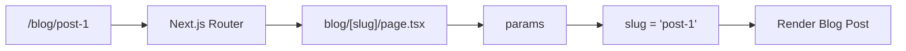

#nextjs #dynamic-routes #app-router #params #routing

## 📖 Definition

In the Next.js App Router, a folder like **`[slug]`** creates a **dynamic route segment**. The value in the URL is captured and made available to the page through the **`params`** prop.

## ⚙️ How It Works

### 1. Create the dynamic route

Project structure:

```text
app/
├── blog/
│   ├── page.tsx
│   └── [slug]/
│       └── page.tsx
```

Here:

```text
[slug]
```

means:

> "This part of the URL can have a dynamic value."

So:

```text
/blog/post-1
/blog/post-2
/blog/nextjs-routing
```

all match:

```text
blog/[slug]/page.tsx
```

### 2. Create the blog listing page

`app/blog/page.tsx`

```tsx
import Link from "next/link";

export default function BlogPage() {
  return (
    <div>
      <h1>My Blog</h1>

      <Link href="/blog/post-1">Post 1</Link>
      <br />

      <Link href="/blog/post-2">Post 2</Link>
    </div>
  );
}
```

This creates:

```text
/blog
```

with links to:

```text
/blog/post-1
/blog/post-2
```

### 3. Create the dynamic page

`app/blog/[slug]/page.tsx`

```tsx
export default async function BlogPost({
  params,
}: {
  params: Promise<{ slug: string }>;
}) {
  const { slug } = await params;

  return (
    <div>
      <h1>Blog Post</h1>
      <p>Slug: {slug}</p>
    </div>
  );
}
```

Now:

```text
/blog/post-1
```

produces:

```text
Slug: post-1
```

and:

```text
/blog/post-2
```

produces:

```text
Slug: post-2
```

### How does `params` get the value?

The flow is:

```text
URL
 ↓
/blog/post-1
 ↓
Next.js matches
 ↓
blog/[slug]/page.tsx
 ↓
slug = "post-1"
 ↓
params = { slug: "post-1" }
 ↓
page receives params
```



### Important: `params` is supplied by Next.js

You **don't manually create**:

```tsx
params = {
  slug: "post-1"
}
```

Next.js extracts `post-1` from the URL because `[slug]` is a dynamic segment and passes it to your page.

**Real-world example — Blog system:**  
A blog can have thousands of posts without creating thousands of separate route files. `blog/[slug]/page.tsx` handles `/blog/post-1`, `/blog/post-2`, `/blog/react-server-components`, etc., and the `slug` tells the page which post was requested.

## 🖼️ Visual Reference

Image search: "Next.js dynamic routes params slug App Router diagram"

## ⚠️ Interview Traps & Gotchas

|Question/Angle|Key Answer|Gotcha/Follow-up|
|---|---|---|
|What does `[slug]` mean?|A dynamic URL segment.|`[slug]` is a parameter name; it doesn't mean the URL must literally contain `slug`.|
|What is `/blog/post-1`?|A concrete URL matching `/blog/[slug]`.|`post-1` becomes the value of `slug`.|
|What is `params`?|Data containing dynamic route parameters provided by Next.js.|You don't manually construct it from the URL.|
|What is `params.slug` / `slug`?|The actual dynamic value, e.g. `"post-1"`.|The property name comes from `[slug]`.|
|Can the folder be `[id]` instead?|Yes.|Then the parameter becomes `params.id`.|
|Does one `[slug]` page handle multiple posts?|**Yes.**|You typically use the slug to fetch the corresponding post data.|
|Is `[slug]` the same as a query parameter?|No.|`/blog/post-1` is a route segment; `?id=post-1` is a query string.|

## ⚡ Quick Revision

- `[slug]` → **dynamic route segment**.
    
- `/blog/post-1` → `slug = "post-1"`.
    
- `/blog/post-2` → `slug = "post-2"`.
    
- **Next.js extracts the URL value and provides it through `params`.**
    
- One `blog/[slug]/page.tsx` can handle **many blog posts**.
    

|Topic|Quick Recall|
|---|---|
|`[slug]`|Dynamic route segment|
|`/blog/post-1`|`slug = "post-1"`|
|`params`|Dynamic route data supplied by Next.js|
|`[id]`|Would produce `params.id`|
|Main benefit|One page handles many dynamic URLs|
