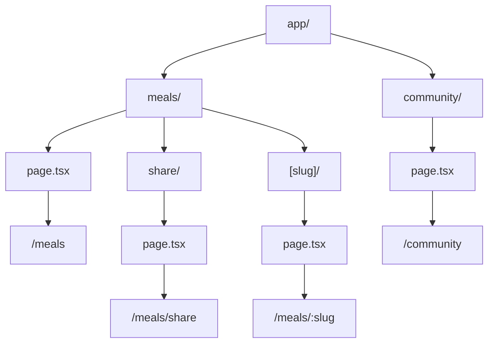

## 📖 Definition

For the food project, we can create three main routes: **`/meals`**, **`/meals/share`**, and **`/community`**. In the App Router, each route is created through the filesystem, while a dynamic segment such as `[slug]` can be added under `/meals` when individual meals need their own URLs.

## ⚙️ How It Works

### 1. `/meals`

Create:

```text
app/
└── meals/
    └── page.tsx
```

This gives:

```text
/meals
```

Example:

```tsx
export default function MealsPage() {
  return <h1>Meals</h1>;
}
```

---

### 2. `/meals/share`

Create:

```text
app/
└── meals/
    ├── page.tsx
    └── share/
        └── page.tsx
```

This gives:

```text
/meals
/meals/share
```

Here:

> `meals` = route segment  
> `share` = nested route segment  
> `page.tsx` = exposes the page

---

### 3. `/community`

Create:

```text
app/
├── meals/
│   ├── page.tsx
│   └── share/
│       └── page.tsx
│
└── community/
    └── page.tsx
```

This gives:

```text
/meals
/meals/share
/community
```

---

### 4. Dynamic route under `/meals`

If the application needs individual meal pages:

```text
app/
└── meals/
    ├── page.tsx
    ├── share/
    │   └── page.tsx
    └── [slug]/
        └── page.tsx
```

Now:

```text
/meals/pizza
/meals/burger
/meals/chicken-biryani
```

can all be handled by the **same**:

```text
meals/[slug]/page.tsx
```

The flow is:

```text
/meals
   ↓
meals/page.tsx

/meals/share
   ↓
meals/share/page.tsx

/community
   ↓
community/page.tsx

/meals/pizza
   ↓
meals/[slug]/page.tsx
   ↓
slug = "pizza"
```



**Real-world example — Food app:**  
`/meals` displays all available meals, `/meals/share` lets users submit/share a meal, `/community` displays community content, and `/meals/[slug]` can display an individual meal such as `/meals/chicken-biryani`.

## 🖼️ Visual Reference

Image search: "Next.js App Router nested dynamic routes meals example"

## ⚠️ Interview Traps & Gotchas

|Question/Angle|Key Answer|Gotcha/Follow-up|
|---|---|---|
|How do you create `/meals`?|`app/meals/page.tsx`|`meals` becomes the URL segment.|
|How do you create `/meals/share`?|`app/meals/share/page.tsx`|`share` is nested inside `meals`.|
|How do you create `/community`?|`app/community/page.tsx`|It is a separate top-level route.|
|How do you create dynamic meal URLs?|`app/meals/[slug]/page.tsx`|`[slug]` matches different meal names.|
|`/meals/pizza` and `/meals/burger` use different files?|**No.**|Both can use `[slug]/page.tsx`.|
|Is `/meals/share` a dynamic route?|No.|`share` is a static route; `[slug]` is dynamic.|

## ⚡ Quick Revision

- `app/meals/page.tsx` → **`/meals`**
    
- `app/meals/share/page.tsx` → **`/meals/share`**
    
- `app/community/page.tsx` → **`/community`**
    
- `app/meals/[slug]/page.tsx` → **dynamic meal routes**
    
- **Static folder = fixed URL; `[folder]` = dynamic URL segment.**
    

| Topic          | Quick Recall               |
| -------------- | -------------------------- |
| `/meals`       | `meals/page.tsx`           |
| `/meals/share` | `meals/share/page.tsx`     |
| `/community`   | `community/page.tsx`       |
| Dynamic meals  | `meals/[slug]/page.tsx`    |
| `[slug]`       | Captures dynamic URL value |
