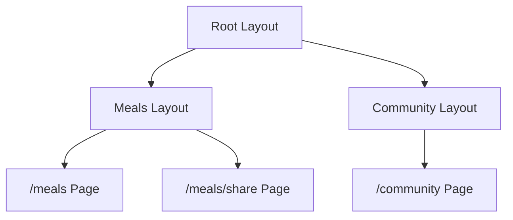

## 📖 Definition

In the Next.js App Router, a `layout.tsx` is a **shared UI wrapper** for all pages and layouts inside its route segment. Layouts can be **nested**, so a page can be wrapped by the root layout, a section layout such as `meals/layout.tsx`, and potentially a deeper layout.

## ⚙️ How It Works

For your food project:

```text
/meals
/meals/share
/community
```

Start with this structure:

```text
app/
├── layout.tsx
├── page.tsx
│
├── meals/
│   ├── layout.tsx
│   ├── page.tsx
│   └── share/
│       └── page.tsx
│
└── community/
    ├── layout.tsx
    └── page.tsx
```

### 1. Root layout

`app/layout.tsx`

This is the **outermost layout**.

```tsx
export default function RootLayout({
  children,
}: {
  children: React.ReactNode;
}) {
  return (
    <html>
      <body>
        <header>Global Navbar</header>

        {children}

        <footer>Global Footer</footer>
      </body>
    </html>
  );
}
```

It wraps the entire application:

```text
Root Layout
    │
    ├── Home
    ├── Meals
    └── Community
```

### 2. Meals layout

Create:

```text
app/meals/layout.tsx
```

```tsx
export default function MealsLayout({
  children,
}: {
  children: React.ReactNode;
}) {
  return (
    <section>
      <h1>Meals</h1>

      <nav>
        All Meals | Share Meal
      </nav>

      {children}
    </section>
  );
}
```

Now **every page inside `/meals`** gets this layout.

That means:

```text
/meals
/meals/share
```

both receive the Meals layout.

Conceptually:

```text
/meals
   ↓
Root Layout
   ↓
Meals Layout
   ↓
Meals Page
```

and:

```text
/meals/share
   ↓
Root Layout
   ↓
Meals Layout
   ↓
Share Page
```

### 3. Community layout

You could also create:

```text
app/community/layout.tsx
```

```tsx
export default function CommunityLayout({
  children,
}: {
  children: React.ReactNode;
}) {
  return (
    <section>
      <h1>Community</h1>

      {children}
    </section>
  );
}
```

Now:

```text
/community
```

gets:

```text
Root Layout
    ↓
Community Layout
    ↓
Community Page
```

### Multiple layouts

This is the important concept.

```text
app/
│
├── layout.tsx                  ← Global
│
├── meals/
│   ├── layout.tsx              ← Meals section
│   ├── page.tsx                ← /meals
│   │
│   └── share/
│       └── page.tsx            ← /meals/share
│
└── community/
    ├── layout.tsx              ← Community section
    └── page.tsx                ← /community
```

The rendering hierarchy becomes:



### What happens when navigating?

For `/meals/share`:

```text
Root Layout
    ↓
Meals Layout
    ↓
Share Page
```

For `/community`:

```text
Root Layout
    ↓
Community Layout
    ↓
Community Page
```

The key idea is:

> **A layout applies to its route segment and all its child segments.**

So `meals/layout.tsx` automatically applies to `/meals` **and** `/meals/share`.

### Why is this useful?

Imagine your food app has:

```text
Global Layout
    → Navbar + Footer

Meals Layout
    → Meals navigation + category sidebar

Community Layout
    → Community navigation + community sidebar
```

You don't have to repeat those elements in every page.

**Real-world example — Food app:**  
The root layout contains the global navbar/footer, while `meals/layout.tsx` contains meal-specific navigation. Both `/meals` and `/meals/share` inherit the Meals layout, while `/community` uses its own Community layout.

## 🖼️ Visual Reference

Image search: "Next.js nested layouts App Router root layout child layout diagram"

## ⚠️ Interview Traps & Gotchas

|Question/Angle|Key Answer|Gotcha/Follow-up|
|---|---|---|
|What does `meals/layout.tsx` affect?|`/meals` and all routes nested inside `/meals`.|It doesn't affect `/community`.|
|Does every page get the root layout?|Yes, routes under the root `app/` inherit it.|Root layout is the outermost application layout.|
|Can layouts be nested?|**Yes.**|A child layout renders inside its parent layout.|
|What is `children`?|The page or nested layout rendered inside the current layout.|This is how the wrapper composition works.|
|Does `meals/share/page.tsx` need its own layout?|No.|It automatically inherits `meals/layout.tsx` if one exists.|
|What happens when navigating between `/meals` and `/meals/share`?|The shared Meals layout can remain mounted while the page content changes.|This is an important benefit of nested layouts.|
|Is a layout the same as a page?|No.|`page.tsx` represents route UI; `layout.tsx` wraps route UI.|

## ⚡ Quick Revision

- **Root `layout.tsx` → wraps the whole app.**
    
- **`meals/layout.tsx` → wraps `/meals` + everything under `/meals`.**
    
- **`community/layout.tsx` → wraps `/community` + its children.**
    
- Layouts can be **nested: Root → Section → Page**.
    
- `children` is the **page/nested layout rendered inside the current layout**.
    

|Topic|Quick Recall|
|---|---|
|Root layout|Global wrapper|
|Meals layout|Applies to `/meals` and `/meals/*`|
|Community layout|Applies to `/community` and `/community/*`|
|Nested layouts|Parent layout → child layout → page|
|`children`|Content rendered inside the layout|
|Main benefit|Shared UI without repeating it across pages|
