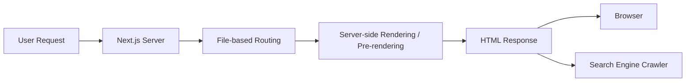

## 📖 Definition

**Next.js combines frontend and backend capabilities within a single application framework**, allowing UI and server-side functionality to coexist in one project. Its key benefits include **file-based routing** and **server-side rendering/pre-rendering**, which can simplify development and improve SEO.

## ⚙️ How It Works

- **Frontend + Backend in one project** — Next.js allows React UI and server-side functionality to live within the same application.
    
- **File-based routing** — routes are created from the project's file/folder structure rather than requiring a separate routing package.
    
- **Pre-rendering** — Next.js can generate HTML on the server before sending it to the browser.
    
- **SEO benefit** — search engines can receive meaningful HTML content instead of relying entirely on client-side JavaScript execution.
    
- This makes Next.js useful for products where **UI, server-side logic, routing, and rendering** need to work together.
    

**Real-world example — E-commerce product page:**  
A product URL such as `/products/iphone` can be mapped through Next.js file-based routing, with the page pre-rendered into HTML so users receive content quickly and search engines can more easily understand the product page.

## 🖼️ Visual Reference

Image search: "Next.js frontend backend file based routing SSR architecture diagram"

## ⚠️ Interview Traps & Gotchas

|Question/Angle|Key Answer|Gotcha/Follow-up|
|---|---|---|
|How does Next.js blend frontend and backend?|Both frontend UI and server-side functionality can exist within the same Next.js application.|Same project does not necessarily mean the same execution environment.|
|What is file-based routing?|The file/folder structure determines application routes.|No separate routing package is required for Next.js routing.|
|What is pre-rendering?|HTML is generated before being sent to the browser.|Don't equate all Next.js rendering with SSR; Next.js supports multiple rendering strategies.|
|Why is pre-rendering useful for SEO?|Search engines can access meaningful HTML content more easily.|SEO is not guaranteed merely by using Next.js.|
|Does Next.js always render pages on the server?|No.|Rendering strategy depends on how the page is built/configured.|
|Why combine frontend and backend?|It reduces the need to manage separate application layers for many use cases.|Large systems may still use separate backend services. [VERIFY]|

## ⚡ Quick Revision

- **Next.js = frontend + server-side capabilities in one framework.**
    
- **File structure → routes**, without a separate routing package.
    
- **Pre-rendered HTML → better crawler accessibility and SEO potential.**
    
- Don't say **"Next.js always uses SSR"** — it supports multiple rendering strategies.
    

|Topic|Quick Recall|
|---|---|
|Full-stack|Frontend + server-side capabilities in one Next.js application|
|Routing|File-based routing|
|Pre-rendering|HTML generated before reaching the browser|
|SEO|Pre-rendered HTML can make content easier for search engines to crawl|
|Key benefit|One framework for UI, routing, server-side logic, and rendering|