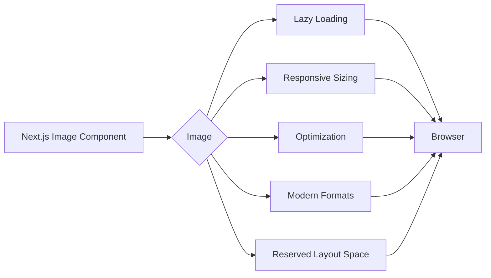

## 📖 Definition

The Next.js **`Image` component** (`next/image`) is an optimized replacement for the standard HTML `` element in many Next.js applications. It provides built-in image optimization features such as **lazy loading, responsive sizing, modern formats, and layout stability**, reducing unnecessary image-related performance costs.

## ⚙️ How It Works

Instead of:

```jsx

```

use:

```jsx
import Image from "next/image";

<Image
  src="/food.jpg"
  alt="Delicious meal"
  width={500}
  height={300}
/>
```

Next.js can then optimize how the image is delivered.

### Main benefits

- **Lazy loading** → Images that aren't immediately needed can be loaded later as they approach the viewport.
    
- **Responsive image sizing** → Next.js can serve an appropriately sized image based on the device/display.
    
- **Image optimization** → Next.js can optimize image delivery rather than always serving the original large asset.
    
- **Modern image formats** → The image optimization pipeline can serve modern formats such as **WebP** when appropriate.
    
- **Prevents layout shifts** → Providing dimensions allows the browser to reserve space before the image loads, improving **CLS (Cumulative Layout Shift)**.
    
- **Automatic resizing** → Different image sizes can be generated/served depending on the requested display size.
    
- **Remote image support** → Images can come from configured external domains/URL patterns.
    
- **Performance optimization** → Smaller, appropriately sized images can reduce bandwidth and improve loading performance.
    
- **Priority loading** → Images that are important for the initial viewport can be configured for eager/priority loading rather than lazy loading.
    

### Why not simply use ``?

```text

  ↓
Browser loads the specified image
  ↓
Developer manages optimization
```

With:

```text
next/image
    ↓
Next.js Image Optimization
    ↓
Resize / optimize / choose suitable format
    ↓
Browser
```



**Real-world example — Food ordering app:**  
A food app may display hundreds of meal images. Using `next/image` allows images outside the initial viewport to be lazy-loaded and enables appropriately sized optimized images instead of unnecessarily downloading large originals.

## 🖼️ Visual Reference

Image search: "Next.js Image component optimization lazy loading responsive images diagram"

## ⚠️ Interview Traps & Gotchas

|Question/Angle|Key Answer|Gotcha/Follow-up|
|---|---|---|
|Why use `next/image` instead of ``?|It provides Next.js image optimization and performance features.|`` is still valid HTML; `Image` is a framework optimization layer.|
|Does `Image` lazy-load images?|Generally yes for images that aren't prioritized for initial loading.|Important above-the-fold images may need eager/priority treatment.|
|Why provide `width` and `height`?|To establish the image's dimensions and help prevent layout shifts.|They don't necessarily mean the browser always downloads exactly those pixel dimensions.|
|What is the SEO/performance benefit?|Better image loading and performance can contribute to a better user experience.|`next/image` itself doesn't guarantee higher SEO rankings.|
|Can `Image` load external images?|Yes.|External sources need to be configured appropriately in Next.js.|
|Does it always serve WebP?|It can serve modern formats when supported/configured appropriately.|Don't say WebP is guaranteed for every request.|
|What is the biggest performance benefit?|Delivering appropriately optimized images and avoiding unnecessary loading.|Don't claim every image is automatically tiny or optimized in every scenario.|

## ⚡ Quick Revision

- **`next/image` = optimized image component for Next.js.**
    
- **Lazy loading** → don't load unnecessary images immediately.
    
- **Responsive sizing** → serve an appropriate image size.
    
- **Modern formats** → can serve formats such as WebP when appropriate.
    
- **Dimensions → helps prevent layout shifts (CLS).**
    
- External images require **configuration**.
    
- Above-the-fold/important images can be configured for **eager/priority loading**.
    

|Topic|Quick Recall|
|---|---|
|`next/image`|Next.js optimized image component|
|Lazy loading|Loads non-critical images when needed|
|Responsive sizing|Appropriate image dimensions for the device|
|Modern formats|Can serve optimized formats such as WebP|
|Layout stability|Dimensions help prevent CLS|
|Remote images|Supported with appropriate configuration|
|Main benefit|**Better image loading and performance with less manual optimization**|