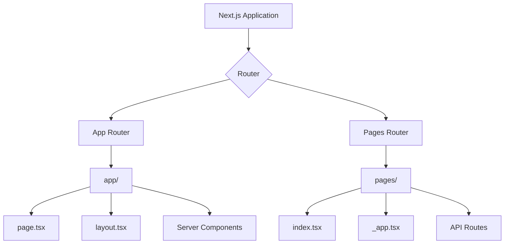
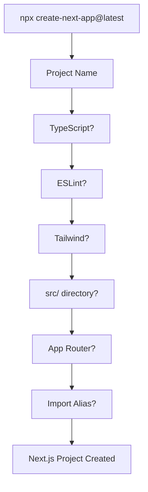

## 📖 Definition

`npx create-next-app@latest` is the official CLI command used to **bootstrap a new Next.js application** with the selected framework, language, styling, routing, and project-structure options. The prompts determine the initial architecture and developer tooling of your project. ([Next.js](https://nextjs.org/docs?utm_source=chatgpt.com "Next.js Docs | Next.js"))

## ⚙️ How It Works

Run:

```bash
npx create-next-app@latest
```

`npx` executes the `create-next-app` package without requiring you to install the CLI globally.

You will typically be asked questions like these:

### 1. What is your project name?

```text
What is your project named?
```

- Determines the **folder/name of your application**.
    
- Example:
    

```text
my-next-app/
```

- This does **not** affect routing or application behavior.
    

---

### 2. Would you like to use TypeScript?

```text
Would you like to use TypeScript?
```

**Yes → recommended for modern Next.js applications.**

- Enables `.ts` and `.tsx` files.
    
- Provides **static type checking**.
    
- Helps catch errors during development.
    
- Improves autocomplete and refactoring.
    
- Next.js automatically configures the required TypeScript setup. ([Next.js](https://nextjs.org/learn/dashboard-app/getting-started?utm_source=chatgpt.com "App Router: Getting Started | Next.js"))
    

```text
JavaScript
   ↓
No type checking

TypeScript
   ↓
Static type checking
   ↓
Better safety + autocomplete
```

**Interview answer:**

> TypeScript adds compile-time type safety to the React/Next.js application.

---

### 3. Would you like to use ESLint?

```text
Would you like to use ESLint?
```

**Yes → recommended.**

ESLint analyzes your code and identifies:

- Potential bugs
    
- Bad practices
    
- Code-quality issues
    
- Common JavaScript/React mistakes
    

Think:

```text
Write code
   ↓
ESLint analyzes it
   ↓
Warnings / errors
   ↓
Fix problems early
```

**Interview trap:** ESLint is **not the TypeScript compiler**.

- TypeScript → type checking
    
- ESLint → code-quality/linting rules
    

---

### 4. Would you like to use Tailwind CSS?

```text
Would you like to use Tailwind CSS?
```

**Yes → if you want utility-first CSS.**

Example:

```tsx
<button className="bg-blue-500 px-4 py-2 text-white">
  Login
</button>
```

Instead of writing a separate CSS rule for every style.

- Tailwind provides utility classes.
    
- `create-next-app` can automatically install/configure it.
    
- You can also use regular CSS/CSS Modules instead. ([Next.js](https://nextjs.org/learn/dashboard-app/css-styling?utm_source=chatgpt.com "App Router: CSS Styling | Next.js"))
    

**Interview answer:**

> Tailwind is a CSS framework that provides utility classes for styling UI directly in markup.

---

### 5. Would you like your code inside a `src/` directory?

```text
Would you like your code inside a `src/` directory?
```

This controls **project organization**, not application behavior.

Without:

```text
my-app/
├── app/
├── public/
├── package.json
└── ...
```

With:

```text
my-app/
├── src/
│   └── app/
├── public/
├── package.json
└── ...
```

Useful for keeping application source code separated from configuration and other root-level files.

**Interview takeaway:** `src/` is mainly an **organizational choice**.

---

# 6. App Router or Pages Router?

This is one of the **most important interview questions**.

```text
Would you like to use App Router?
```

You generally choose:

```text
Yes → App Router
No  → Pages Router
```

Next.js currently supports both routers. The **App Router is the newer router** and supports newer React features such as Server Components; the Pages Router is the original router and remains supported. ([Next.js](https://nextjs.org/docs?utm_source=chatgpt.com "Next.js Docs | Next.js"))

---

## App Router

App Router uses the:

```text
app/
```

directory.

Example:

```text
app/
├── page.tsx
├── about/
│   └── page.tsx
└── dashboard/
    ├── page.tsx
    └── settings/
        └── page.tsx
```

Routes:

```text
app/page.tsx
        ↓
       /

app/about/page.tsx
        ↓
      /about

app/dashboard/page.tsx
        ↓
    /dashboard

app/dashboard/settings/page.tsx
        ↓
 /dashboard/settings
```

The important idea is:

> **Folders represent route segments, and `page.tsx` makes that route accessible.** ([Next.js](https://nextjs.org/learn/dashboard-app/creating-layouts-and-pages?utm_source=chatgpt.com "App Router: Creating Layouts and Pages | Next.js"))

### Important App Router files

```text
app/
├── layout.tsx
├── page.tsx
├── loading.tsx
├── error.tsx
└── not-found.tsx
```

These special files provide framework behavior for routes.

A major App Router concept is **Server Components**. App Router is designed around newer React capabilities including Server Components. ([Next.js](https://nextjs.org/docs?utm_source=chatgpt.com "Next.js Docs | Next.js"))

---

## Pages Router

Pages Router uses:

```text
pages/
```

Example:

```text
pages/
├── index.tsx
├── about.tsx
└── products/
    └── [id].tsx
```

Routes:

```text
pages/index.tsx
       ↓
      /

pages/about.tsx
       ↓
    /about

pages/products/[id].tsx
       ↓
 /products/:id
```

A file inside `pages` becomes a route based on its filename. ([Next.js](https://nextjs.org/learn/pages-router/navigate-between-pages-pages-in-nextjs?utm_source=chatgpt.com "Pages Router: Pages in Next.js | Next.js"))

Pages Router also has special files such as:

```text
pages/_app.tsx
pages/_document.tsx
pages/404.tsx
```

It also supports API Routes:

```text
pages/api/users.ts
```

which can expose an API endpoint. ([Next.js](https://nextjs.org/learn/pages-router/api-routes-setup?utm_source=chatgpt.com "Pages Router: Set up | Next.js"))

---

## App Router vs Pages Router



||App Router|Pages Router|
|---|---|---|
|Directory|`app/`|`pages/`|
|Routing|Folder + special files|File-based|
|Server Components|Core/new architecture|Not the same model|
|Layouts|Built-in `layout.tsx`|Traditionally `_app.tsx` / component patterns|
|API|Route Handlers|API Routes|
|Status|**Recommended for new apps**|Legacy/original, still supported|

**Interview answer:**

> **App Router is the modern Next.js routing architecture built around the `app` directory and newer React features such as Server Components. Pages Router is the older `pages`-based architecture and is still supported, especially for existing applications.**

---

### 7. Would you like to customize the import alias?

```text
Would you like to customize the import alias?
```

Usually:

```text
@/*
```

Example:

```tsx
import Button from "@/components/Button";
```

instead of:

```tsx
import Button from "../../../components/Button";
```

It makes imports cleaner and avoids long relative paths.

**Interview trap:** Import aliases do **not** change the application's URL routes. They only affect how modules are imported.

---

## Complete Setup Flow



**Real-world example — starting a production React application:**  
For a new TypeScript project, you might choose **TypeScript + ESLint + Tailwind + `src/` + App Router + `@/*` alias**, giving you a typed, linted, styled and modern Next.js project structure from the start.

## 🖼️ Visual Reference

Image search: "create-next-app CLI prompts App Router Pages Router TypeScript Tailwind project structure"

## ⚠️ Interview Traps & Gotchas

| Question/Angle                                 | Key Answer                                                   | Gotcha/Follow-up                                                              |
| ---------------------------------------------- | ------------------------------------------------------------ | ----------------------------------------------------------------------------- |
| What does `npx create-next-app@latest` do?     | Bootstraps a new Next.js application.                        | `npx` executes the CLI; it doesn't mean Next.js itself is installed globally. |
| App Router vs Pages Router?                    | App Router uses `app/`; Pages Router uses `pages/`.          | App Router is the newer architecture and supports Server Components.          |
| Which router should you use for a new project? | **App Router** is the modern choice.                         | Pages Router is still supported for existing applications.                    |
| How does App Router routing work?              | Folders create route segments; `page.tsx` exposes the route. | A random component file doesn't automatically become a public route.          |
| How does Pages Router routing work?            | Files under `pages/` map to routes.                          | `pages/index.tsx` maps to `/`.                                                |
| Why choose TypeScript?                         | Static type checking and better developer tooling.           | TypeScript checks types; ESLint checks code quality/style.                    |
| Why choose `src/`?                             | Keeps application source code organized separately.          | It doesn't change how your application fundamentally works.                   |
| Why choose an import alias?                    | Cleaner imports such as `@/components/Button`.               | It is unrelated to URL routing.                                               |

## ⚡ Quick Revision

- `create-next-app` **bootstraps/configures** a Next.js project.
    
- **App Router → `app/` → modern architecture + Server Components.**
    
- **Pages Router → `pages/` → original router, still supported.**
    
- **TypeScript → type safety; ESLint → code quality; Tailwind → utility CSS.**
    
- `src/` = organization; `@/*` = cleaner imports.
    
- **App Router is the default choice for a new project unless you have a reason to use Pages Router.**
    

| Topic             | Quick Recall                                  |
| ----------------- | --------------------------------------------- |
| `create-next-app` | CLI for bootstrapping a Next.js application   |
| TypeScript        | Static type checking                          |
| ESLint            | Code-quality/linting                          |
| Tailwind          | Utility-first CSS                             |
| `src/`            | Organizes source code                         |
| App Router        | `app/`, modern Next.js architecture           |
| Pages Router      | `pages/`, original router, still supported    |
| Import alias      | Cleaner imports such as `@/components/Button` |
