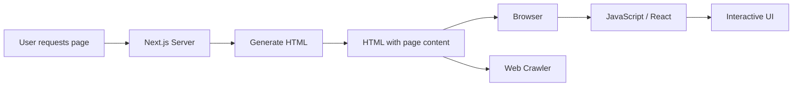

## 📖 Definition

**Next.js can pre-render HTML on the server and send that HTML to the browser**, whereas a typical client-rendered React application initially relies on JavaScript to build the UI in the browser. This server-rendered HTML makes the page content available earlier to **users and web crawlers**.

## ⚙️ How It Works

- In a **Next.js application**, the server can generate the initial HTML before sending it to the client.
    
- The browser receives **HTML containing page content**, rather than an empty root element waiting for JavaScript to render everything.
    
- JavaScript then runs on the client to provide the required interactive behavior.
    
- In a typical **client-rendered React application**, the browser downloads JavaScript and React generates the UI in the browser.
    
- Because Next.js can provide meaningful HTML initially, **web crawlers can more easily access and evaluate page content**.
    
- Important: Next.js supports multiple rendering strategies; **it is not accurate to say every Next.js page is always server-rendered**.
    

**Real-world example — Google search:**  
For a Next.js product page, the server can send HTML containing the product title and content, allowing a crawler such as Googlebot to access meaningful page content without first depending entirely on client-side JavaScript.

## 🖼️ Visual Reference

Image search: "Next.js SSR vs React CSR server rendering browser web crawler diagram"

## ⚠️ Interview Traps & Gotchas

|Question/Angle|Key Answer|Gotcha/Follow-up|
|---|---|---|
|What happens in Next.js initially?|The server can generate HTML and send it to the client.|Don't say every Next.js page is always SSR.|
|How is this different from typical React CSR?|CSR primarily generates the UI in the browser using JavaScript.|React itself can also be used with other rendering strategies.|
|Why does server-rendered HTML help SEO?|Crawlers can access meaningful HTML content earlier.|SEO depends on more than just rendering strategy.|
|Does Next.js send only HTML?|No.|Client-side JavaScript is still used where interactivity is needed.|
|What is the key benefit?|Faster initial content availability and better crawler accessibility.|Don't automatically claim SSR always means faster overall performance.|
|What does "hydration" mean here?|Client-side React attaches behavior to the server-rendered HTML.|Rendering HTML and making it interactive are separate steps.|

## ⚡ Quick Revision

- **Next.js can render HTML on the server → send HTML to browser.**
    
- **React CSR → JavaScript runs in browser to generate the UI.**
    
- Server-rendered HTML makes content **more immediately accessible to crawlers**.
    
- **SSR ≠ always used by every Next.js page.**
    

|Topic|Quick Recall|
|---|---|
|Next.js|Can generate HTML on the server|
|React CSR|UI is primarily generated in the browser|
|SEO|Server-rendered HTML can improve crawler accessibility|
|Hydration|React makes server-rendered HTML interactive|
|Key distinction|**Server-generated HTML vs browser-generated UI**|