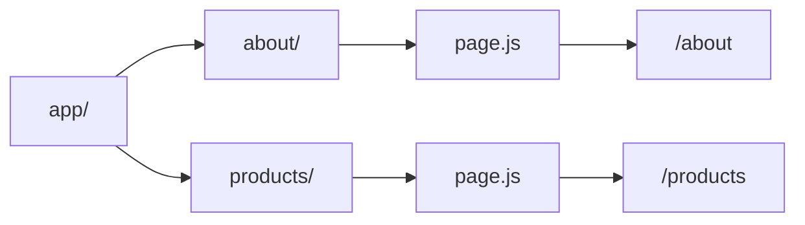

## 📖 Definition

In the **Next.js App Router**, a route is created using a **folder + `page.js` (or `page.tsx`)** combination. The folder determines the URL path, while `page.js` defines the UI rendered at that route.

## ⚙️ How It Works

- Create a folder inside the `app/` directory.
    
- Add a `page.js` or `page.tsx` file inside that folder.
    
- The **folder name becomes the URL segment**.
    
- `page.js` makes that route accessible and contains the page UI.
    
- Nested folders create nested URL paths.

**Real-world example — E-commerce:**  
`app/products/page.js` creates the `/products` route, while `app/products/[id]/page.js` can represent an individual product route such as `/products/123`.

## 🖼️ Visual Reference

Image search: "Next.js App Router folder page.js file based routing diagram"

## ⚠️ Interview Traps & Gotchas

| Question/Angle                           | Key Answer                                                                 | Gotcha/Follow-up                                 |
| ---------------------------------------- | -------------------------------------------------------------------------- | ------------------------------------------------ |
| How do you create a route in App Router? | Use a folder containing `page.js`/`page.tsx`.                              | The folder alone doesn't create a page route.    |
| What determines the URL?                 | The folder structure determines the URL segments.                          | `page.js` defines the UI for that segment.       |
| What does `app/page.js` represent?       | The root `/` route.                                                        | `app` itself is not part of the URL.             |
| What does `app/about/page.js` represent? | The `/about` route.                                                        | `about` becomes the URL segment.                 |
| Can routes be nested?                    | Yes.                                                                       | Nested folders create nested URL paths.          |
| Is this true for Pages Router?           | No, this specific folder + `page.js` convention belongs to the App Router. | Pages Router uses files directly under `pages/`. |

## ⚡ Quick Revision

- **App Router:** `folder + page.js` → route.
    
- `app/page.js` → `/`
    
- `app/about/page.js` → `/about`
    
- **Folder = URL segment; `page.js` = page UI.**
    

|Topic|Quick Recall|
|---|---|
|App Router routing|Folder + `page.js`|
|URL|Determined by folder structure|
|`page.js`|Defines the UI for the route|
|Root route|`app/page.js` → `/`|
|Key rule|**Folder = path, page.js = page**|
