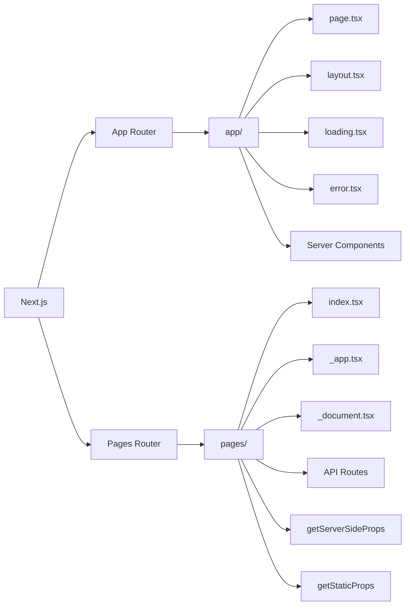

## App Router vs Pages Router

The **App Router** and **Pages Router** are two routing architectures supported by Next.js. For **new applications, App Router is generally the modern/recommended approach**, while Pages Router remains supported and is common in older/legacy Next.js applications.

|Feature|**App Router**|**Pages Router**|
|---|---|---|
|**Introduced**|Next.js 13|Original Next.js routing system|
|**Directory**|`app/`|`pages/`|
|**Basic route**|`app/about/page.tsx` → `/about`|`pages/about.tsx` → `/about`|
|**Routing style**|Folder-based + special files|File-based|
|**Page file**|`page.tsx` required to expose a route|File itself becomes the route|
|**Root route**|`app/page.tsx` → `/`|`pages/index.tsx` → `/`|
|**Nested routes**|`app/products/details/page.tsx` → `/products/details`|`pages/products/details.tsx` → `/products/details`|
|**Dynamic routes**|`app/products/[id]/page.tsx`|`pages/products/[id].tsx`|
|**Catch-all routes**|`[...slug]`|`[...slug]`|
|**Optional catch-all**|`[[...slug]]`|`[[...slug]]`|
|**Layouts**|Built-in `layout.tsx`|No equivalent nested layout system built into routing|
|**Nested layouts**|First-class support|Usually implemented manually with `_app` or custom patterns|
|**Root layout**|`app/layout.tsx`|Typically `_app.tsx`|
|**Shared UI**|`layout.tsx` persists across navigation|Usually handled through `_app.tsx` or custom components|
|**Server Components**|**Supported by default**|Not the App Router model|
|**Client Components**|Add `"use client"`|Components generally run as client-side React components|
|**Server/Client boundary**|Explicit with `"use client"`|Different architecture; no equivalent App Router boundary model|
|**Data fetching**|Can fetch directly in Server Components|Commonly uses `getServerSideProps`, `getStaticProps`, etc.|
|**`getServerSideProps`**|❌ Not used|✅ Supported|
|**`getStaticProps`**|❌ Not used|✅ Supported|
|**`getStaticPaths`**|❌ Not used|✅ Supported|
|**Server-side data fetching**|Native Server Component model|`getServerSideProps`|
|**Static generation**|Supported through App Router APIs|`getStaticProps` / `getStaticPaths`|
|**API endpoints**|Route Handlers|API Routes|
|**API location**|`app/api/users/route.ts`|`pages/api/users.ts`|
|**HTTP methods**|Export `GET`, `POST`, `PUT`, `DELETE`, etc.|Usually inspect `req.method`|
|**Loading UI**|`loading.tsx`|Usually implemented manually|
|**Error handling UI**|`error.tsx`|`_error.tsx` / custom handling|
|**404 page**|`not-found.tsx`|`pages/404.tsx`|
|**Route-level error boundaries**|Built-in `error.tsx` convention|No equivalent built-in route-level convention|
|**Route-level loading state**|Built-in `loading.tsx`|Manual implementation|
|**Streaming**|First-class support|More limited / different model|
|**Suspense integration**|Deeply integrated|Supported through React, but not the same routing architecture|
|**Server Actions**|Supported|Not the standard Pages Router model|
|**Form submissions**|Can use Server Actions|Commonly use API Routes or external backend|
|**Metadata**|`metadata` / `generateMetadata`|`<Head>` from `next/head`|
|**SEO metadata**|Built into App Router conventions|Usually manually configured|
|**Middleware**|Supported|Supported|
|**Navigation**|`next/navigation`|`next/router`|
|**Access current route**|Hooks such as `usePathname()`|`useRouter()`|
|**Router hook**|`useRouter()` from `next/navigation`|`useRouter()` from `next/router`|
|**Rendering model**|Server-first architecture|Traditional Next.js rendering model|
|**React Server Components**|Core feature|Not available in the same way|
|**React Server Actions**|Supported|Not the primary architecture|
|**Code organization**|More conventions/special files|Simpler file-to-route mapping|
|**Learning curve**|Higher|Generally simpler initially|
|**Existing projects**|Best for modern/new projects|Often found in older projects|
|**Migration**|Can migrate incrementally|Can coexist with App Router during migration|
|**Recommended for new projects**|**Yes, generally**|Usually only when existing architecture requires it|
|**Legacy support**|Modern architecture|Still supported|

### The biggest architectural difference



## The most important differences for interviews

### 1. Routing

**App Router:**

```text
app/
└── products/
    └── page.tsx

        ↓

/products
```

**Pages Router:**

```text
pages/
└── products.tsx

        ↓

/products
```

**Remember:**

> App Router = **folder + `page.tsx`**  
> Pages Router = **file itself = route**

---

### 2. Layouts

This is a major App Router advantage.

**App Router:**

```text
app/
├── layout.tsx
├── page.tsx
└── dashboard/
    ├── layout.tsx
    └── page.tsx
```

You can have **nested layouts** that persist while navigating between pages within that route segment.

Pages Router traditionally relies on:

```text
pages/_app.tsx
```

for global application-level wrapping and custom patterns for more complex layouts.

---

### 3. Data Fetching

**Pages Router:**

```tsx
export async function getServerSideProps() {
  // fetch data
}
```

or:

```tsx
export async function getStaticProps() {
  // fetch data
}
```

**App Router:**

Server Components can fetch data directly:

```tsx
export default async function Products() {
  const response = await fetch("...");
  const products = await response.json();

  return <ProductList products={products} />;
}
```

So the mental model changes from:

> **"Which data-fetching function should I use?"**

to:

> **"Can this component fetch the data on the server?"**

---

### 4. Server Components

This is probably the **highest-value App Router interview topic**.

**App Router:**

```text
Component
   │
   ├── Server Component ← default
   │
   └── Client Component ← "use client"
```

You explicitly opt into a Client Component:

```tsx
"use client";
```

This allows Next.js to keep components that don't need browser interactivity on the server.

---

### 5. API Handling

**App Router:**

```text
app/
└── api/
    └── users/
        └── route.ts
```

Example:

```tsx
export async function GET() {
  return Response.json({ users: [] });
}
```

**Pages Router:**

```text
pages/
└── api/
    └── users.ts
```

Example:

```tsx
export default function handler(req, res) {
  res.status(200).json({ users: [] });
}
```

So:

> **App Router → Route Handlers**  
> **Pages Router → API Routes**

---

## 🎯 Interview Cheat Sheet

|If interviewer asks...|Answer|
|---|---|
|Which is newer?|**App Router**|
|Which directory does App Router use?|`app/`|
|Which directory does Pages Router use?|`pages/`|
|App Router page convention?|`folder/page.tsx`|
|Pages Router page convention?|`file.tsx`|
|App Router layouts?|`layout.tsx`, including nested layouts|
|Pages Router global wrapper?|`_app.tsx`|
|App Router loading UI?|`loading.tsx`|
|App Router error UI?|`error.tsx`|
|App Router server components?|**Yes, default**|
|App Router client component?|Add `"use client"`|
|Pages Router SSR?|`getServerSideProps`|
|Pages Router SSG?|`getStaticProps` + `getStaticPaths`|
|App Router API?|Route Handlers|
|Pages Router API?|API Routes|
|Modern choice for new projects?|**App Router**|
|Can both exist in one project?|**Yes**, allowing incremental migration.|

### One-line interview answer

> **"Pages Router is Next.js's original `pages/`-based routing architecture, while App Router is the newer `app/`-based architecture built around nested layouts, Server Components, loading/error boundaries, and newer React features."**