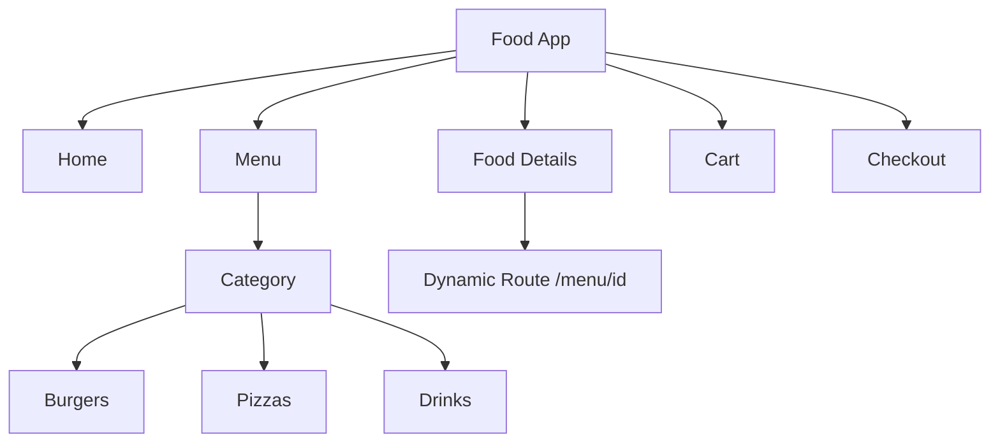

Yes — a **small food-ordering project is a very good way to learn the App Router**, because you can naturally use routes, nested routes, layouts, dynamic routes, server components, client components, data fetching, and forms.

### Suggested project: 🍔 Food Ordering App



### App Router structure

```text
app/
├── layout.tsx
├── page.tsx
│
├── menu/
│   ├── page.tsx
│   ├── burgers/
│   │   └── page.tsx
│   └── pizzas/
│       └── page.tsx
│
├── food/
│   └── [id]/
│       └── page.tsx
│
├── cart/
│   └── page.tsx
│
└── checkout/
    └── page.tsx
```

This lets you understand the most important App Router concept:

> **Folder = route segment, `page.tsx` = UI for that route.**

For example:

```text
app/menu/page.tsx
        ↓
      /menu

app/menu/burgers/page.tsx
        ↓
   /menu/burgers

app/food/[id]/page.tsx
        ↓
   /food/123
```

### What you should deliberately practice

1. **`layout.tsx`** → common Navbar/Footer across the application.
    
2. **`page.tsx`** → create individual pages.
    
3. **Nested routes** → `/menu/burgers`.
    
4. **Dynamic routes** → `/food/[id]`.
    
5. **Server Components** → fetch food data on the server.
    
6. **Client Components** → cart quantity buttons/interactions using `"use client"`.
    
7. **`loading.tsx`** → loading UI while menu data loads.
    
8. **`error.tsx`** → handle route-level errors.
    
9. **Route Handlers** → create something like `/api/foods`.
    
10. **Forms / Server Actions** → submit an order.
    

### Best learning sequence

```text
Routes
  ↓
Nested Routes
  ↓
Dynamic Routes
  ↓
Layouts
  ↓
Server Components
  ↓
Client Components
  ↓
Data Fetching
  ↓
Loading / Error
  ↓
Route Handlers
  ↓
Server Actions
```

**Don't build the whole food app at once.** Build one concept at a time and understand **why App Router provides each feature**. That will be much better interview preparation than simply copying a Next.js tutorial.