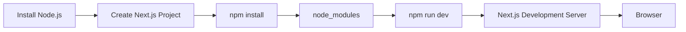

## 📖 Definition

A Next.js project requires **Node.js** as the JavaScript runtime and **npm** as the package manager. After creating the project, dependencies are installed and `npm run dev` starts the Next.js development server.

## ⚙️ How It Works

- **Install Node.js** → provides the runtime required to execute Next.js tooling and JavaScript outside the browser.
    
- **Create the Next.js project** → typically using `create-next-app`.
    
- **Install dependencies** → `npm install` reads `package.json` and installs the required packages into `node_modules`.
    
- **Start development server** → `npm run dev` executes the `dev` script defined in `package.json`.
    
- The application becomes available through the local development server, typically at `http://localhost:3000`.
    

**Real-world example — Food ordering app:**  
After creating your Next.js food project, you run `npm install` to install its dependencies and `npm run dev` to start the local development server so you can open the food application in your browser.

## 🖼️ Visual Reference

Image search: "Next.js Node.js npm project setup development server diagram"

## ⚠️ Interview Traps & Gotchas

|Question/Angle|Key Answer|Gotcha/Follow-up|
|---|---|---|
|Why do we need Node.js?|Next.js development tooling and server-side JavaScript run using Node.js.|Node.js is a runtime, not a package manager.|
|What does `npm install` do?|Installs dependencies declared in `package.json`.|It creates/populates `node_modules`; it doesn't start the application.|
|What is `node_modules`?|Directory containing installed project dependencies.|It is generally not committed to Git.|
|What does `npm run dev` do?|Runs the project's `dev` script from `package.json`.|It starts the development server; it is not the production start command.|
|`npm install` vs `npm run dev`?|`install` → dependencies; `run dev` → development server.|They perform completely different jobs.|
|What is `package.json`?|Defines project metadata, dependencies, and scripts.|`npm run dev` gets the command from its `scripts` section.|

## ⚡ Quick Revision

- **Node.js → runtime**
    
- **npm → package manager**
    
- `npm install` → installs dependencies → `node_modules`
    
- `npm run dev` → starts the Next.js development server
    
- **`package.json` → dependencies + scripts**
    

|Topic|Quick Recall|
|---|---|
|Node.js|JavaScript runtime|
|npm|Package manager|
|`npm install`|Installs dependencies|
|`node_modules`|Installed packages|
|`npm run dev`|Starts development server|
|`package.json`|Dependencies + project scripts|