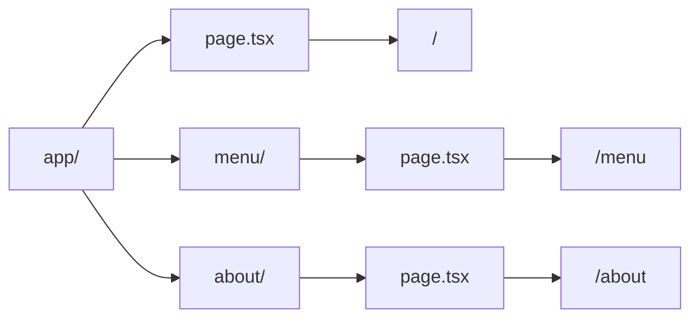
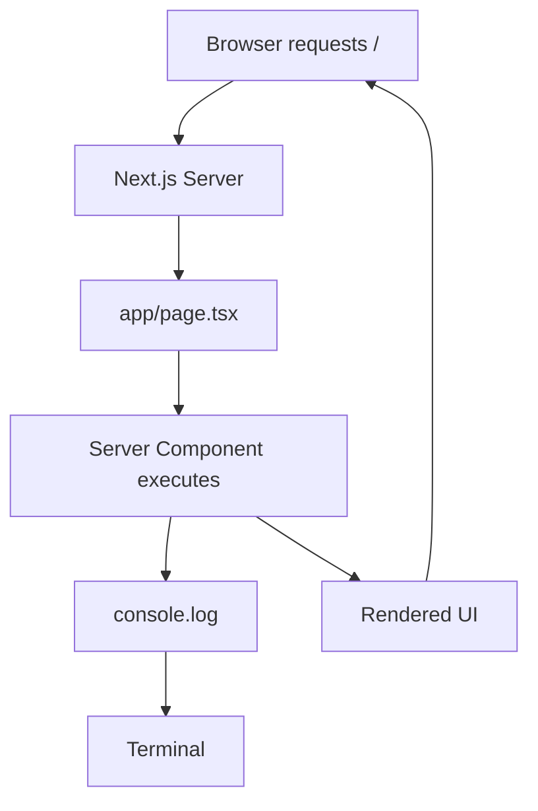

## 📖 Definition

In the **Next.js App Router**, routing is based on the filesystem, where `app/page.tsx` represents the root `/` route. By default, components inside the App Router are **React Server Components**, meaning their component code executes on the server unless marked with `"use client"`.

## ⚙️ How It Works

### 1. File-based routing

- `app/page.tsx` → `/`
    
- `app/about/page.tsx` → `/about`
    
- `app/menu/page.tsx` → `/menu`
    
- The **folder name creates the route segment**.
    
- `page.tsx` defines the UI rendered for that route.
    

### 2. React Server Components

- In the App Router, components are **Server Components by default**.
    
- A Server Component executes on the **server**.
    
- You can verify this experimentally by using `console.log()` inside `app/page.tsx`.
    
- When you access the page, the log appears in the **terminal running Next.js**, rather than the browser console.
    
- If you add `"use client"`, the component becomes a **Client Component** and can execute in the browser.
    

**Real-world example — Food ordering app:**  
If `app/menu/page.tsx` contains `console.log("Menu page")`, opening `/menu` will show the log in the **Next.js server terminal** because the page is a Server Component by default. If you add `"use client"`, browser-side execution becomes possible and client-side logs can appear in the browser console.

## 🖼️ Visual Reference

Image search: "Next.js App Router React Server Components server client architecture diagram"

## ⚠️ Interview Traps & Gotchas

|Question/Angle|Key Answer|Gotcha/Follow-up|
|---|---|---|
|What does `app/page.tsx` represent?|The `/` route.|`app` itself isn't part of the URL.|
|How does file-based routing work?|Folders create route segments and `page.tsx` exposes the route.|A normal component file isn't automatically a route.|
|Are App Router components Server Components by default?|**Yes.**|`"use client"` changes a component to a Client Component.|
|Where does `console.log()` execute in a Server Component?|On the server, so you normally see it in the Next.js terminal.|Don't expect it in the browser console.|
|Does Server Component mean no HTML reaches the browser?|No.|The server produces output that is sent to the browser.|
|How do you make a Client Component?|Add `"use client"` at the top of the file.|Client Components are needed for browser-side interactivity such as state and event handlers.|
|Can Server Components use browser APIs like `window`?|No.|Browser-only APIs belong in Client Components.|

## ⚡ Quick Revision

- **`app/page.tsx` → `/`**
    
- **App Router → file-based routing.**
    
- **Server Components are the default** in App Router.
    
- `console.log()` in a Server Component → **check the terminal**.
    
- `"use client"` → Client Component → browser-side capabilities.
    

|Topic|Quick Recall|
|---|---|
|File-based routing|Folder + `page.tsx` determines the route|
|`app/page.tsx`|Root `/` route|
|Server Component|Default in App Router|
|Server `console.log()`|Appears in Next.js terminal|
|Client Component|Add `"use client"`|
|Key distinction|**Server Component → server execution; Client Component → browser capabilities**|